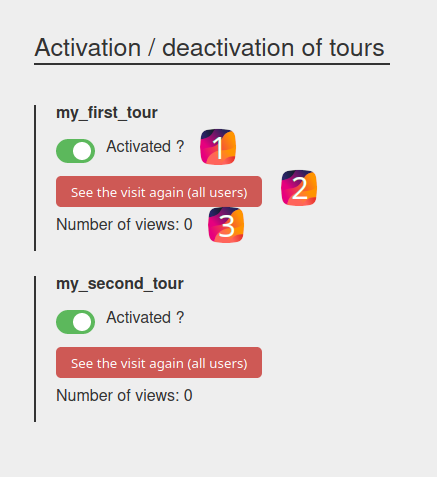

# Administration

By default, a route `/administration/tours` is accessible in order to set up the tours

Here is the rendering of this page:



- All tours are listed in alphabetical order.
- By default, a tour is active.
- You can disable/enable tour (1).
- You can force the re-display of a visit to all users even if they have already seen it (2).
- A counter of the number of times each Tour is available (3).

### Customization

To customize the style, it is possible to extend the default template`templates/bundles/RichIdTourBundle/administration/tours.html.twig`


```html



<style>
    :root {
        --rich-id-tour-label-color: ...;
        --rich-id-tour-toggle-background: ...;
        --rich-id-tour-toggle-checked-background: ...;

        --rich-id-tour-button-color: ...;
        --rich-id-tour-button-background: ...;

        --rich-id-tour-toggle-success-alert-background-color: ...;

        --rich-id-tour-administration-background-color: ...;
        --rich-id-tour-administration-title-color: ...;

        --rich-id-tour-font-family: ...;
    }
</style>


```
